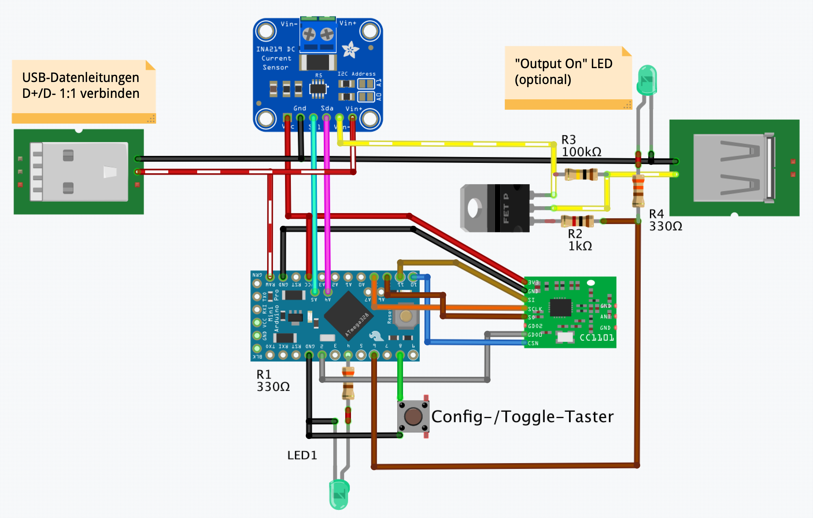

# HB-ES-PMSw1-USB
Homebrew Homematic USB Strom-/Spannungsmesser mit INA219

Benötigt [JP-HB-Devices Addon mind. V 4.2](https://github.com/jp112sdl/JP-HB-Devices-addon/releases)

In der Arduino IDE muss noch folgende Lib eingebunden werden:
- https://github.com/jp112sdl/INA219_WE

### Aktueller Stand (14.03.2021):
- CCU Unterstützung bereitgestellt (Addon V 4.2)
- Sketch lauffähig

### schematischer Schaltungsaufbau

###  🚧 PCB - WORK IN PROGRESS

Projekt-Thread im HomeMatic-Forum: https://homematic-forum.de/forum/viewtopic.php?f=76&t=66307
